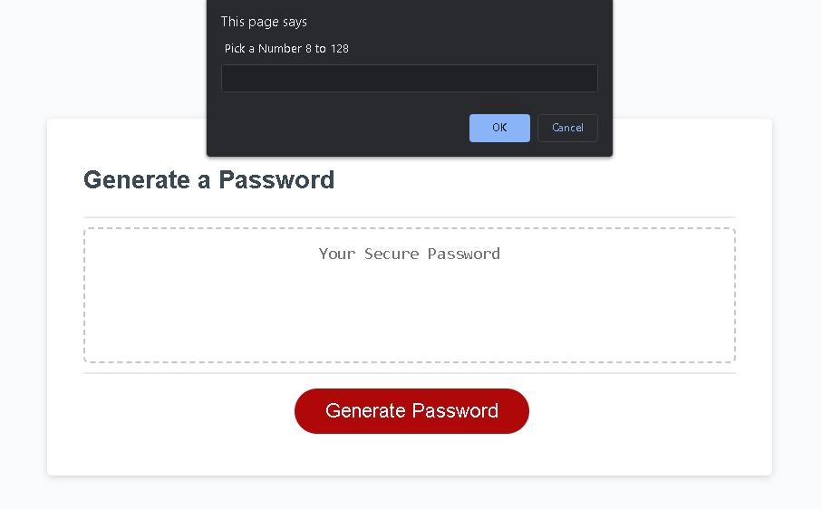
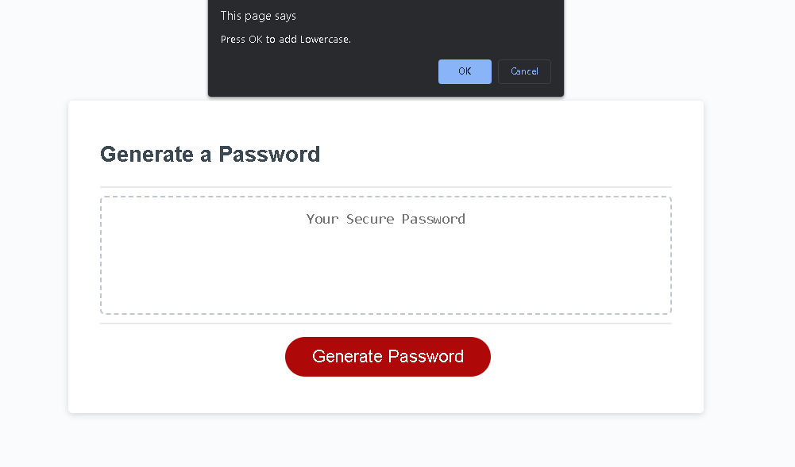
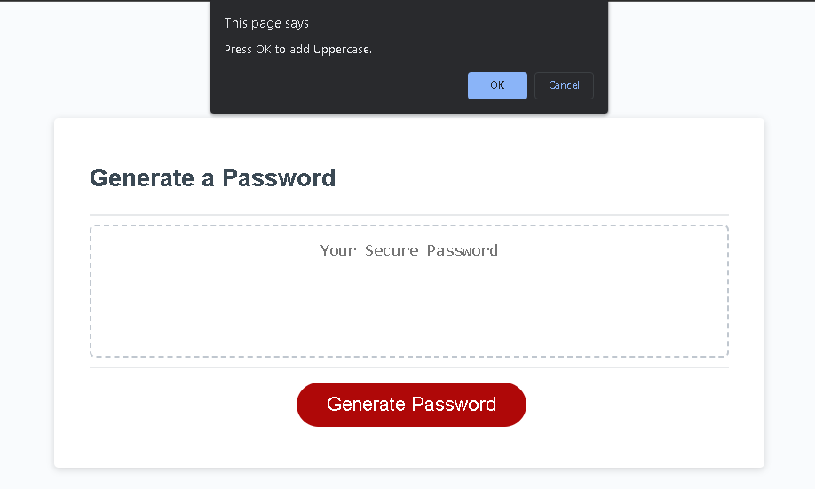
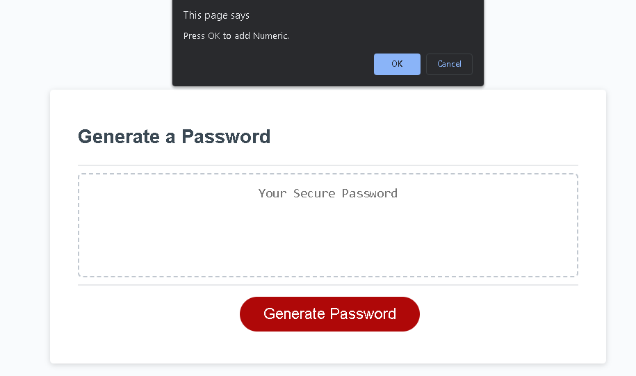
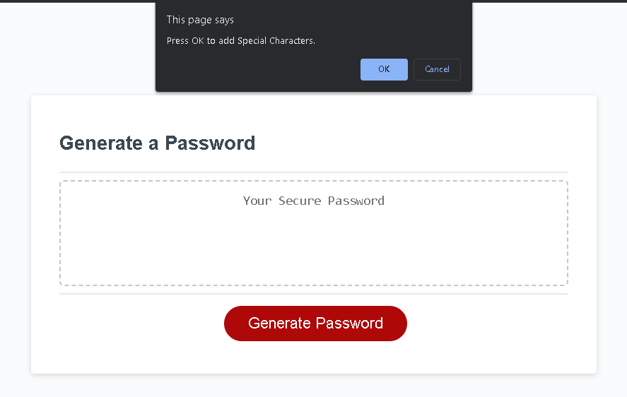
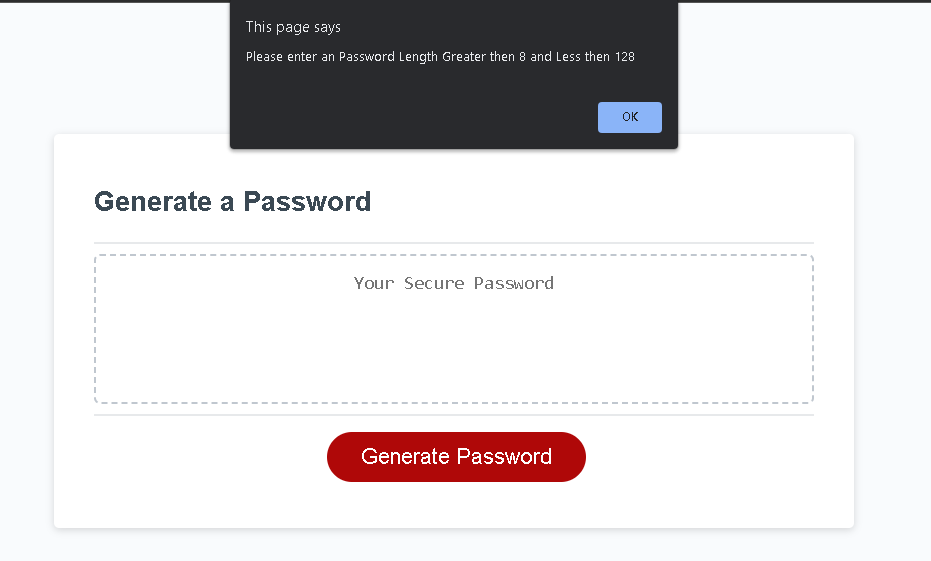
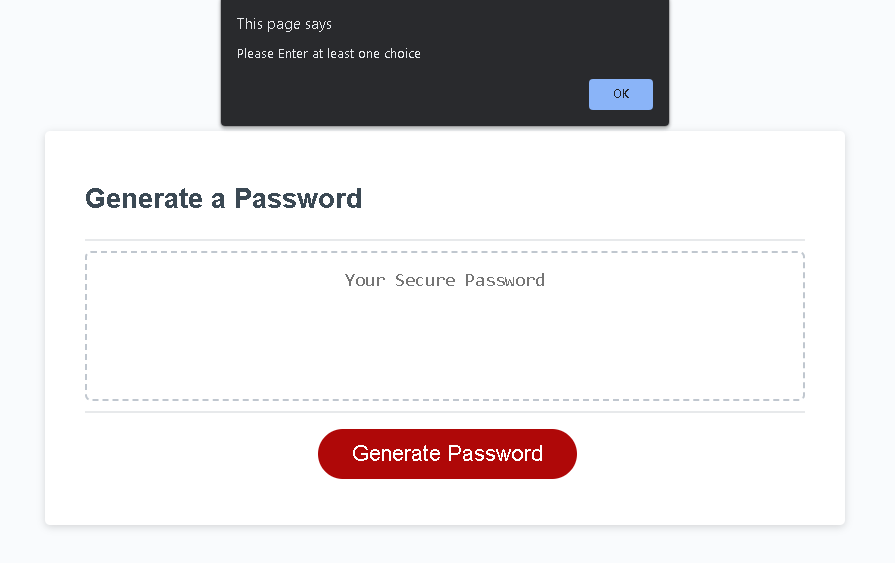

# javascript password gen
My week 3 assigment 

Website https://glitchvegas.github.io/javascript-password-gen/

I had to make an Javascript Password generator 

So i made it by using the window prompt so when you click on the button it'll first prompt pick an number

Then it'll ask to press ok for Lowercase

Then ask to press ok for Uppercase

Then ask to press ok for Numeric

Then ask if you want to add special characters

Once that is finish it'll for a for loop til it randomly picks a character for the length you pick

If you enter any letters or greater then 128 or less then 8 you'll be asked to re-enter an correct amount

If you don't select any of the choices it'll tell you that you need to select at least one choice

